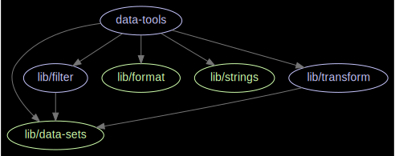
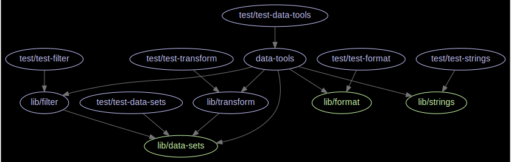

# data-tools

Tools for data manipulation

[![Travis-CI][travis-img]][travis-url]
[![Code Climate][codeclimate-img]][codeclimate-url]
[![Code Climate][codeclimate-issues-img]][codeclimate-issues-url]
[![js-standard-style][standard-img]][standard-url]

## Installation

``` bash
  $ npm install 'data-tools'
```

## [Documentation](docs/index.html)

## [Test Coverage](coverage/lcov-report/index.html)

## Architecture
The following dependency graphs are automatically generated using [this](https://github.com/pahen/madge) tool. 3rd party modules are not shown.

Without tests:


With tests:


## Usage
...


## Tests
``` bash
  $ npm test
```


## License
[MIT][license-url]


[license-url]: LICENSE

[standard-img]: https://img.shields.io/badge/code%20style-standard-brightgreen.svg
[standard-url]: http://standardjs.com/

[travis-img]: https://img.shields.io/travis/bagrounds/data-tools/master.svg
[travis-url]: https://travis-ci.org/bagrounds/data-tools

[codeclimate-img]: https://codeclimate.com/github/bagrounds/data-tools/badges/gpa.svg
[codeclimate-url]: https://codeclimate.com/github/bagrounds/data-tools

[codeclimate-issues-img]: https://codeclimate.com/github/bagrounds/data-tools/badges/issue_count.svg
[codeclimate-issues-url]: https://codeclimate.com/github/bagrounds/data-tools/issues
